# [R et l'Accessibilité : <br>De la production accessible par la pratique.]{style="color: #eee"}

# R et l'Accessibilité : <br>[De la production accessible par la pratique.]{.text-primary}

::: notes
mise en situation d'accessibilité inversée
:::

## C'est pour qui l'accessibilité ?

::: incremental
- **1.5 %** des développeurs sont déficients visuels permanents.
- **4 %** de l'audience souffre de daltonisme.
- **Déficience auditive** : acouphènes, environnements bruyants.
- **Déficience physique** : navigation et accès au travers du *clavier
  seulement*.
- **12 %** de la population atteinte de troubles du neuro-développement
  (troubles "dys").
- **100 %** de la population fera face à un trouble temporaire ou
  situationnel.
:::

::: notes
Exemple: les lunettes

Exemple: regarder un écran en plein soleil

Exemple: Tout le monde souffrira un handicap temporaire

Exemple: future you
:::

------------------------------------------------------------------------

::: {.callout-tip icon="false"}
## Un objectif de communication

L'accessibilité n'est pas un compromis sur l'esthétique, c'est le moyen
le plus efficace d'atteindre ses objectifs ce communication.
:::

- 🎯 **Ne pas rater son message**
- 👥 **Capturer toute son audience**, ne pas laisser naître un sentiment
  de rejet.
- 🧠 **Réduire l'effort psychique** nécessaire à l'appropriation des
  données présentées.
- 🤝 **Accueillir une communauté** de développeurs inclusive autour d'un
  package

## Les normes {.smaller}

La recommandation du W3C [Accessible Rich Internet Applications
(WAI-ARIA) 1.2](https://www.w3.org/TR/wai-aria-1.2/), de juin 2023.

La directive **(UE) 2019/882** relative aux exigences en matière
d'accessibilité applicables aux produits et services, dite **EAA**
(*European Accessibility Act*).

Adoptée en Europe en avril 2019, publiée en France en Mars 2023.

::::: columns
::: {.column width="60%"}
### Calendrier d'application

- **Juin 2025** : Obligatoire pour les *nouveaux* produits et services.
- **Juin 2030** : Obligatoire pour *tous* les produits et services
  existants.
:::

::: {.column width="40%"}
### Les Sanctions

{width="100%"}
:::
:::::

::: notes
500€ / jour d'astreinte et 10k€ de dommage et intérêt
:::

## Agenda

::::: columns
::: {.column width="50%"}
- 🎨 Les couleurs
- 📊 Les graphiques
- 📋 Les tableaux
:::

::: {.column width="50%"}
- 💻 Le code & le CLI
- ✨ Les applis Shiny
- 📄 Les documents (HTML/PDF)
:::
:::::

## L'outillage d'accessibilité {.smaller}

### 1. Assistance active

- Les lecteurs d'écran : NVDA (MS-Windows), JAWS (Linux), VoiceOver
  (MacOS)

### 2. Outils de test (HTML / Pages Web)

::: panel-tabset
### Extensions Navigateur

- [Firefox Web Developer
  Add-on](https://addons.mozilla.org/fr/firefox/addon/web-developer/)
- [Chrome
  Lighthouse](https://chromewebstore.google.com/detail/lighthouse/blipmdconlkpinefehnmjammfjpmpbjk)

### Toolkits

- [WAVE Web Evaluation Tool](https://wave.webaim.org/)
- Plus d'outils pour les germanophones : [BITV Test
  Toolkit](https://bitvtest.de/test-methodik/web/werkzeugliste#tablesbm)
:::

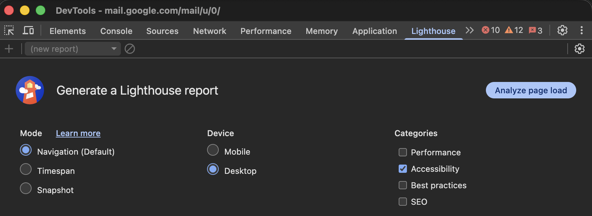{align="center" width="60%"}

## Les Couleurs

- **Pièges fréquents** : Mauvais contrastes, information uniquement
  basée sur la couleur.
- **Bonnes pratiques** : Valider les ratios de contraste:
  - minimum 4,5:1 pour le texte normal.
  - minimum 3:1 pour les éléments graphiques significatifs.

Outils de simulation en action

- [viz4.net/palettes](https://www.vis4.net/palettes/#/9%7Cd%7C00429d,96ffea,ffffe0%7Cffffe0,ff005e,93003a%7C0%7C1)
- [ColorBrewer
  2.0](https://colorbrewer2.org/#type=sequential&scheme=YlGn&n=5) —
  Sélection de palettes de couleur par usage, pour l'accessibilité.
- ...

::: notes
à partir de viz-palette, on fait un aller-retour vers colorbrewer2 (ou
pas, puisqu'on peut déja y choisir les palettes compatibles)
:::

## Graphiques : Le problème {.smaller}

`ggplot2` possède de bons paramètres par défaut, mais ils restent
insuffisants pour l'accessibilité (lignes trop fines, contrastes
faibles).

::::: columns
::: {.column width="50%"}
``` r
theme_set(theme_grey(base_size = 11))
g0 <- ggplot(
  data = plot_data,
  mapping = aes(x = x, y = y, colour = category)
) +
  geom_line()
g0
```
:::

::: {.column width="50%"}
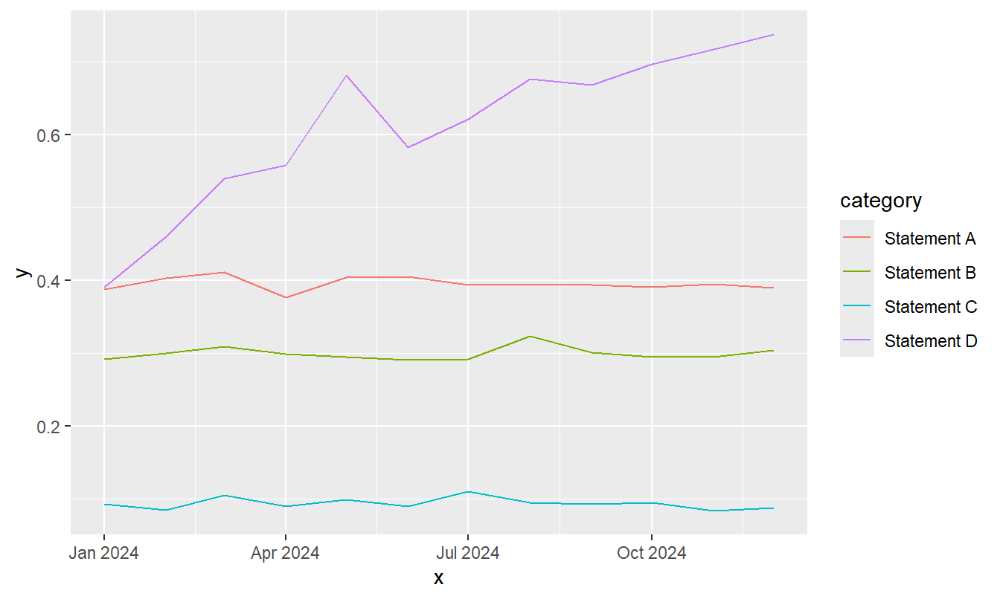
:::
:::::

------------------------------------------------------------------------

### bonnes pratiques : la taille {.smaller}

::::: columns
::: {.column width="50%"}
``` r
theme_set(theme_grey(base_size = 16))
g <- ggplot(
  data = plot_data,
  mapping = aes(x = x, y = y, colour = category)
) +
  geom_line(linewidth = 2)
g
```
:::

::: {.column width="50%"}
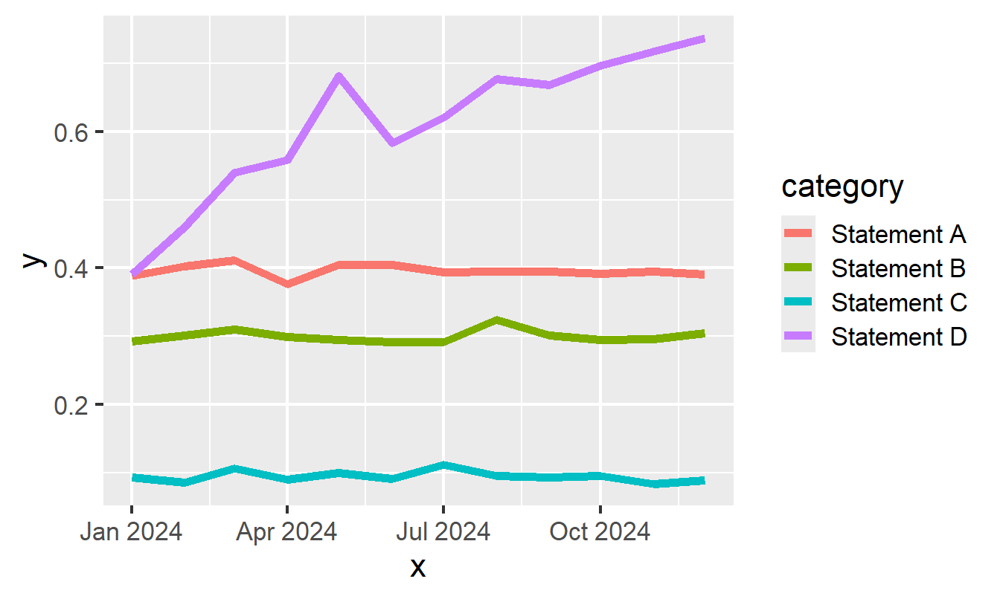
:::
:::::

------------------------------------------------------------------------

### bonnes pratiques : les couleurs {.smaller}

::::: columns
::: {.column width="50%"}
``` r
theme_set(theme_minimal(base_size = 16))
g <- g + scale_colour_manual(values = okabeito)
g
```
:::

::: {.column width="50%"}
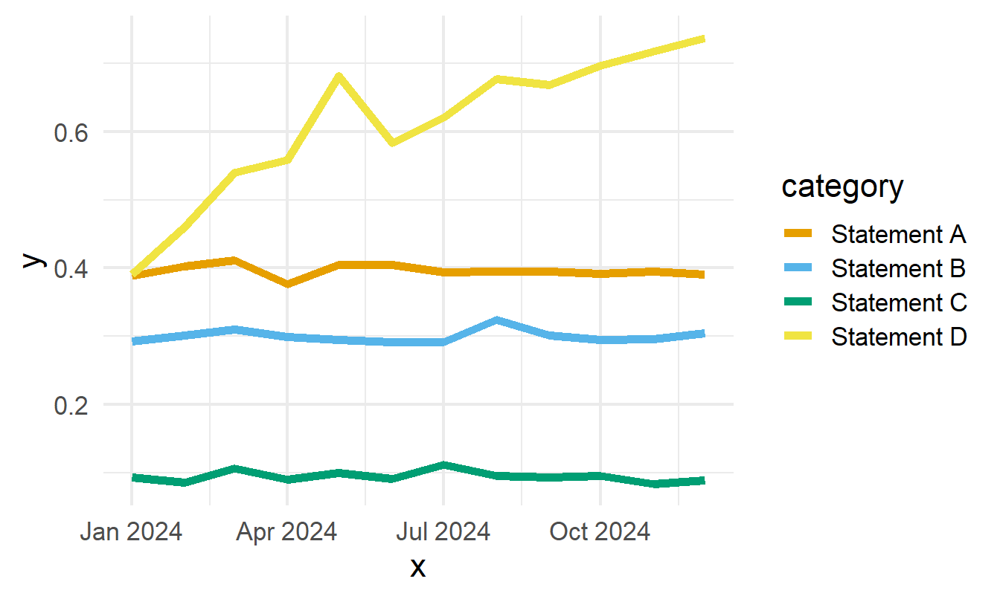
:::
:::::

------------------------------------------------------------------------

### bonnes pratiques : ne pas s'appuyer sur les couleurs {.smaller}

::::: columns
::: {.column width="50%"}
``` r
g <- g +
  geom_point(
    data = slice_max(plot_data, x),
    size = 4
  ) +
  new_scale_colour() +
  scale_colour_manual(values = new_palette) +
  geom_text(
    data = slice_max(plot_data, x),
    mapping = aes(label = category, colour = category),
    hjust = -0.1,
    size.unit = "pt",
    size = 14
  ) +
  scale_x_date(
    date_labels = "%b",
    breaks = seq(
      as.Date("01-01-2024", tryFormats = "%d-%m-%Y"),
      length.out = 4,
      by = "3 months"
    ),
    limits = c(
      as.Date("01-01-2024", tryFormats = "%d-%m-%Y"),
      as.Date("01-02-2025", tryFormats = "%d-%m-%Y")
    )
  ) +
  theme(legend.position = "none")
g
```
:::

::: {.column width="50%"}
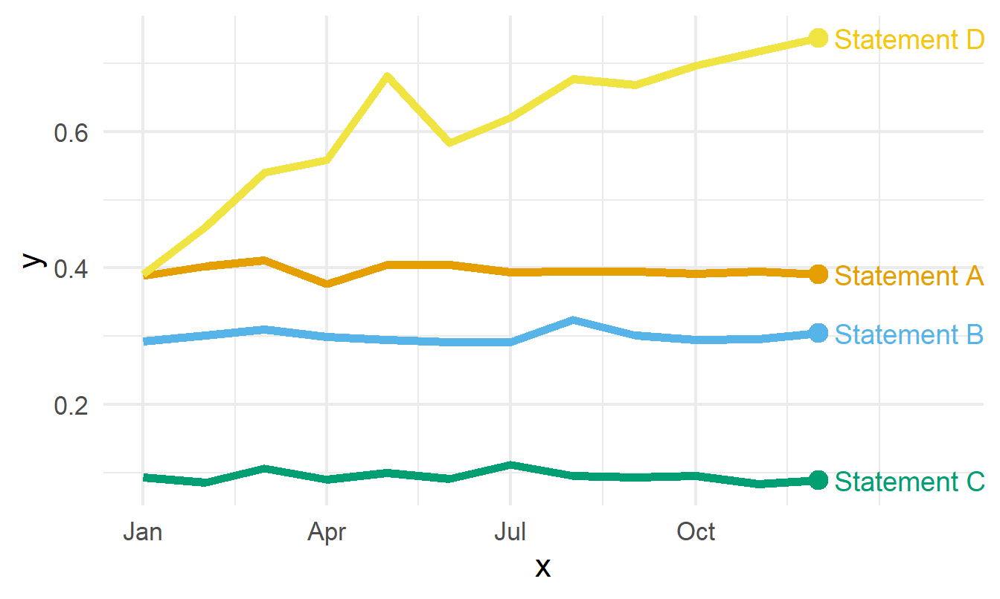
:::
:::::

------------------------------------------------------------------------

### bonnes pratiques : les petits multiples {.smaller}

::::: columns
::: {.column width="50%"}
``` r
theme_set(theme_bw(base_size = 16))
g2 + facet_wrap(~category) +
  gghighlight(use_direct_label = FALSE) +
  scale_x_date(
    date_labels = "%b",
    breaks = seq(
      as.Date("01-01-2024", tryFormats = "%d-%m-%Y"),
      length.out = 4,
      by = "3 months"
    ),
    limits = c(
      as.Date("01-01-2024", tryFormats = "%d-%m-%Y"),
      as.Date("15-12-2024", tryFormats = "%d-%m-%Y")
    )
  ) +
  theme(axis.title = element_blank())
```
:::

::: {.column width="50%"}
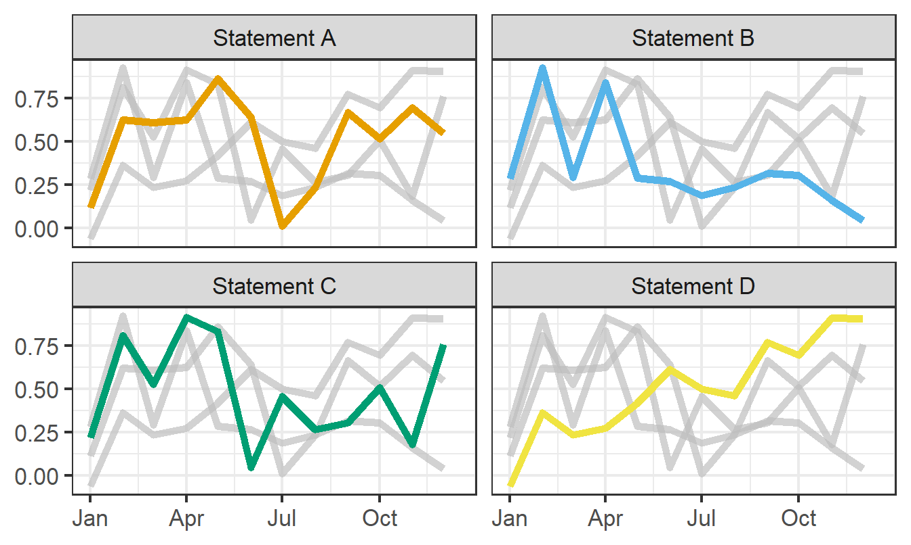
:::
:::::

::: callout-note
Étude de cas complète

Retrouvez le blog de Nicola Rennie sur la création de graphiques
linéaires accessibles :

🔗 Nicola Rennie - Accessible Line Chart
:::

## Alt-text pour les graphiques

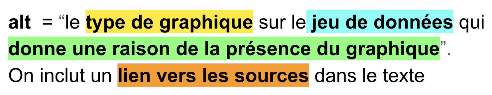{fig-alt="Le format des alt-text pour les dataviz en 4 informations clefs. Type de graphique, Jeu de données, raison du graphique, lien vers les sources."}

------------------------------------------------------------------------

Le package {ggalttext} fait la moitié du chemin :

``` r
install.packages("ggalttext", repos = c("https://y-sunflower.r-universe.dev"))
library(ggalttext)
g2 <- g2 + 
  xlab("Mois de l'année") + 
  ylab("Résultat (%)" )
generate_alt_text(plot, lang="fr")
[1] "Graphique en lignes de résultat en (%) en fonction du mois de l'année."
```

**Type de graphique** : Il est nécessaire de nommer la famille de
graphique, pour donner le contexte à la suite du texte alternatif. ex:
*un diagramme à barres*

Pour le nom des diagrammes, consultez le guide de datavisualization de
[toulouse-dataviz.fr](https://toulouse-dataviz.notion.site/4cea244c76d0407b9722d300e798a3c2?v=f3b7a520de214623a766a5b68456097b)

**Jeu de données** : Quelles données sont présentes dans le graphique ?
les variables des axes x et y le plus généralement

**Raison de la présence du graphique**: Pourquoi avoir inclus ce
graphique, que fait il apparaître : une mention de chaque information
visuelle, qui indique quoi regarder.

**Lien vers les sources** : à inclure dans le texte, pas dans
l'alt-text, pour en faire profiter à tout le monde.

------------------------------------------------------------------------

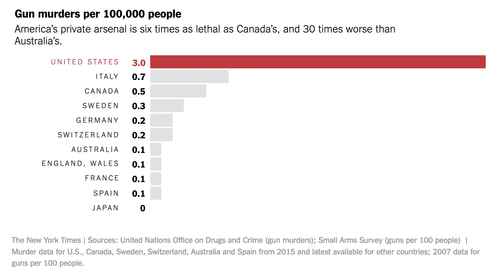

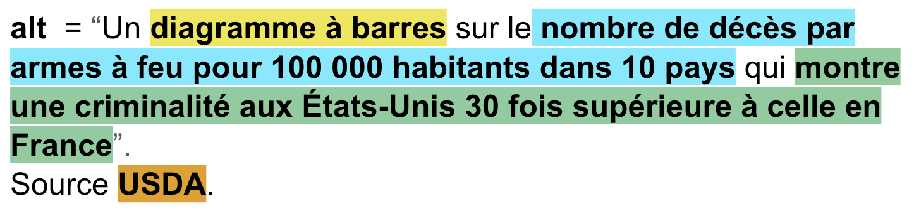

|                                     |
|:------------------------------------|
| Plus difficile                      |
| 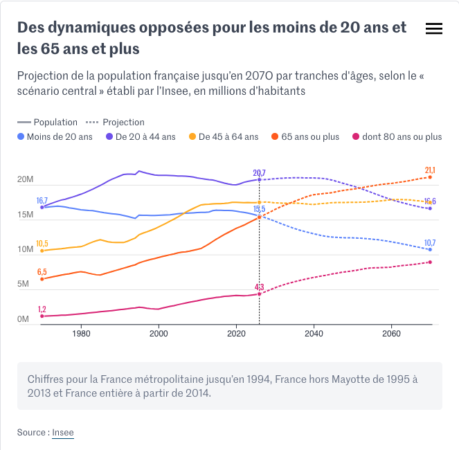 |
| 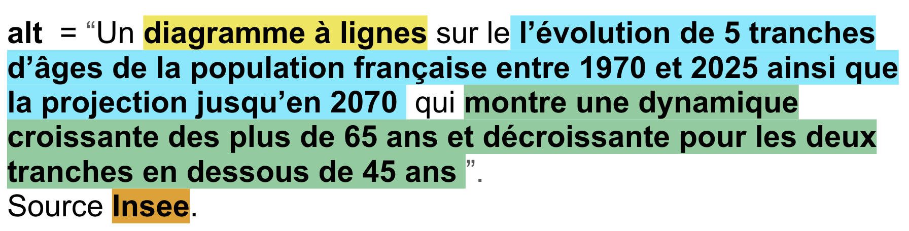 |

## Tableaux

::::: columns
::: {.column width="60%"}
Mauvaises vs Bonnes Pratiques

```         
Erreur classique : 
- Tableaux sous forme d'images non lues
- tableau avec caractères de séparation des colonnes
- fusion de cellules complexe.

Règle d'or : 
- Déclarer explicitement les en-têtes de colonnes et de lignes (<th>).  
- Eviter la complexité accrue
```
:::

::: {.column width="40%"}
Expérimentation (spreadsheet)

[Accessibility Empathy for
spreadsheets](https://analysisfunction.civilservice.gov.uk/blog-2/accessibility-empathy-for-spreadsheets/):
Penser à l'utilisateur qui navigue cellule par cellule au clavier.
:::
:::::

## Applications Shiny

### Le Problème

Les composants web générés par défaut par Shiny ne respectent pas
toujours nativement les critères stricts du WCAG (manque de balises
ARIA, navigation clavier brisée).\
🔗 [Analyse des standards WCAG applicables à
Shiny](https://www.jumpingrivers.com/blog/accessible-shiny-standards-wcag/)

### La Solution : `{a11yShiny}`

Ce package propose des wrappers (enveloppes) accessibles qui forcent le
respect des exigences structurelles de la **BITV 2.0** et du **WCAG 2.1
AA** (validation des étiquettes, gestion du focus, contrastes élevés).

------------------------------------------------------------------------

### Correspondance des fonctions `{a11yShiny}`

| Élément UI | Fonction Native `shiny` / `DT` | Équivalent Accessible `{a11yShiny}` |
|:-----------------------|:-----------------------|:-----------------------|
| **Structure globale** | `fluidPage()` | `a11y_fluidPage(lang = "fr", title = "...")` |
| **Mise en page** | `fluidRow()` / `column()` | `a11y_fluidRow()` / `a11y_column()` |
| **Bouton** | `actionButton()` | `a11y_actionButton()` |
| **Listes & Saisie** | `selectInput()` / `numericInput()` | `a11y_selectInput()` / `a11y_numericInput()` |
| **Tableaux** | `DT::renderDataTable()` | `a11y_renderDataTable()` |
| **Graphiques** | `renderPlot()` (`ggplot2`) | `a11y_ggplot2_line()` / `a11y_ggplot2_bar()` |

------------------------------------------------------------------------

### Exemple d'implémentation UI

Remplacer vos appels de structure et d'inputs classiques :

``` r
library(shiny)
library(a11yShiny)

# Remplacement des fonctions standards par les variantes "a11y_"
ui <- a11y_fluidPage(
  lang = "fr",
  title = "Mon Application Shiny Accessible",
  
  a11y_fluidRow(
    a11y_column(
      width = 6,
      a11y_actionButton("refresh", label = "Rafraîchir les données")
    ),
    a11y_column(
      width = 6,
      a11y_selectInput("choix", label = "Choisir une option", choices = 1:3)
    )
  )
)
```

------------------------------------------------------------------------

## Les packages

pour les developpeurs de packages

### Les messages

- Utiliser {cli} pour formater des messages textuels clairs, en
  fournissant du contexte.

- Pas d'information relayée par les couleurs (Vert = Succès, Rouge =
  Erreur) sans ajouter de texte ou symbole explicite (✔, ✖).

## La documentation (le site web)

exemple d'erreur sur la publication du site web de documentation avec
{pkgdown}

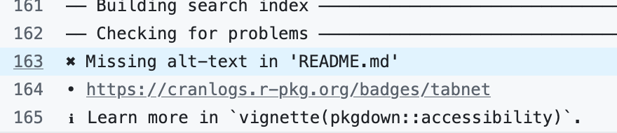

Assurer la cohérence des figures, des styles, des couleurs.

Minimiser la surprise du lecteur

## La production de documents

### HTML (quarto 1.8)

- Vérification de l'accessibilité avec `axe-core` (html, dashboard,
  revealjs)

:::::: columns
::: {.column width="25%"}
``` yaml
format:
  html:
    axe: true
```
:::

::: {.column width="35%"}
``` yaml
format:
  html:
    axe:
      output: document
```
:::

::: {.column width="30%"}
``` yaml
format:
  html:
    axe:
      output: json
```
:::
::::::

### PDF (quarto 1.9)

- Vérification des standard UA-1 et UA-2 (Typst & LaTeX)

------------------------------------------------------------------------

::::: columns
::: {.column width="50%"}
PDF (LaTeX): Standard UA-2

``` yaml
format:
  pdf:
    pdf-standard: ua-2
```

```{mermaid}
flowchart TD
    A["📄 Document source Quarto markdown"]
    B["⚙️ Compilation LaTeX<br/>(Génération du PDF balisé <br/> Pas de contrôle d'accessibilité)"]
    C["🔍 Validation Externe <br/>(Quarto lance veraPDF)"]
    D["⚠️ PDF Final produit avec des Warnings<br/>(Compilation non bloquée <br/> malgré les erreurs)"]

    A --> B
    B --> C
    C --> D

    %% Personnalisation des styles
    style A fill:#f1f5f9,stroke:#64748b,stroke-width:2px,color:#1e293b
    style B fill:#e0f2fe,stroke:#0ea5e9,stroke-width:2px,color:#0369a1
    style C fill:#f0fdf4,stroke:#10b981,stroke-width:2px,color:#14532d
    style D fill:#fef2f2,stroke:#f43f5e,stroke-width:2px,color:#991b1b
```
:::

::: {.column width="50%"}
Typst: Standard UA-1

``` yaml
format:
  typst:
    pdf-standard: ua-1
```

```{mermaid}
flowchart TD
    A["📄 Document source Quarto markdown"]
    B{"🛡️ Validatio native Typst<br/>(Contrôle en temps réel)"}
    C["❌ Blocage lors de la Compilation<br/>(Aucun PDF généré si titre ou alt-text manquant)"]
    D["🔍 Validation Externe (veraPDF)<br/>(Contrôle de conformité finale)"]
    E["✅ PDF Conforme produit"]

    A --> B
    B -->|Infraction détectée| C
    B -->|Structure valide| D
    D --> E

    %% Personnalisation des styles
    style A fill:#f1f5f9,stroke:#64748b,stroke-width:2px,color:#1e293b
    style B fill:#fff7ed,stroke:#ea580c,stroke-width:2px,color:#7c2d12
    style C fill:#fee2e2,stroke:#ef4444,stroke-width:2px,color:#991b1b
    style D fill:#f0fdf4,stroke:#10b981,stroke-width:2px,color:#14532d
    style E fill:#ecfdf5,stroke:#059669,stroke-width:2px,color:#064e3b
```
:::
:::::

------------------------------------------------------------------------

## Exemple

``` markdown
---
title: Test de la validation d'accessibilité quarto

format:
  html: 
    axe:
      output: document
---

Voici une violation des rêgles de contraste: [Texte en contraste insuffisant.]{style="color: #eee"}.
```

package {verapdf} (TBC)

# Questions & partages

https://cregouby.github.io/RR_2026/

::: notes
sources
https://github.com/orgs/quarto-dev/discussions?discussions_q=is%3Aopen+label%3Aaccessibility+
Dataviz Accessibility pages / people :
https://github.com/dataviza11y/resources Whriting Alt-Text :
https://medium.com/nightingale/writing-alt-text-for-data-visualization-2a218ef43f81
Colors : https://colorbrewer2.org/#type=sequential&scheme=YlGn&n=5
https://projects.susielu.com/viz-palette?colors=%5B%22%23e69f00%22%2C%22%2356b4e9%22%2C%22%23009e73%22%2C%22%23f0e442%22%5D&backgroundColor=%22white%22&fontColor=%22black%22&mode=%22deuteranopia%22
:::
