# [La dataviz et l'Accessibilité : <br>De la production accessible par la pratique.]{style="color: #eee"}

# La dataviz et l'Accessibilité : <br>[De la production accessible par la pratique.]{.text-primary}

::: notes
Une mise en situation d'accessibilité inversée premier slide :
l'experience de lecture du dyslexique voire le site de référence
dysclick.fr deuxième slide : l'expérience d'incapacité visuelle
temporaire
:::

## C'est pour qui l'accessibilité ?

::: incremental
- **1.5 %** des développeurs sont déficients visuels permanents.
- **4 %** de l'audience souffre de daltonisme.
- **Déficience auditive** : acouphènes, environnements bruyants.
- **Déficience physique** : navigation et accès au travers du *clavier
  seulement*.
- **12 %** de la population atteinte de troubles du neuro-développement
  (troubles "dys").
- **100 %** de la population fera face à un trouble temporaire ou
  situationnel.
:::

::: notes
Exemple: les lunettes

Exemple: regarder un écran en plein soleil

Exemple: Tout le monde souffrira d'un handicap temporaire

Exemple: future you
:::

------------------------------------------------------------------------

::: {.callout-tip icon="false"}
## Un objectif de communication

L'accessibilité n'est pas un compromis sur l'esthétique, c'est le moyen
le plus efficace d'atteindre ses objectifs ce communication.
:::

- 🎯 **Ne pas rater son message**
- 👥 **Capturer toute son audience**, ne pas laisser naître un sentiment
  de rejet.
- 🧠 **Réduire l'effort psychique** nécessaire à l'appropriation des
  données présentées.
- 🤝 **Accueillir une communauté** de développeurs inclusive autour d'un
  package

## Les normes {.smaller}

La recommandation du W3C [Accessible Rich Internet Applications
(WAI-ARIA) 1.2](https://www.w3.org/TR/wai-aria-1.2/), de juin 2023.

La directive **(UE) 2019/882** relative aux exigences en matière
d'accessibilité applicables aux produits et services, dite **EAA**
(*European Accessibility Act*).

Adoptée en Europe en avril 2019, publiée en France en Mars 2023.

::::: columns
::: {.column width="60%"}
### Calendrier d'application

- **Juin 2025** : Obligatoire pour les *nouveaux* produits et services.
- **Juin 2030** : Obligatoire pour *tous* les produits et services
  existants.
:::

::: {.column width="40%"}
### Les Sanctions

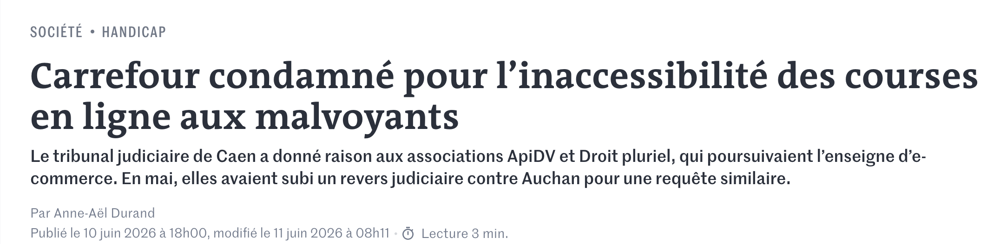{fig-alt="Une coupure du journal lemonde sur la condamnation judiciaire du site d'e-commerce carrefour.fr"
width="100%"}
:::
:::::

::: notes
500€ / jour d'astreinte et 10k€ de dommage et intérêt piur Carrefour.fr.
Source le Monde

Mon niveau d'obligation: rgaa.info/recherche

Réference :
https://cecileuzel.com/web-design-le-blog/l-accessibilite-web-etes-vous-hors-la-loi
:::

## Agenda

::::: columns
::: {.column width="50%"}
- 🎨 Les couleurs
- 📊 Les graphiques
- 📋 Les tableaux
:::

::: {.column width="50%"}
- 💻 Le code & le CLI
- ✨ Les applis Shiny
- 📄 Les documents (HTML/PDF)
:::
:::::

## L'outillage d'accessibilité {.smaller}

### 1. Assistance active

- Les lecteurs d'écran : NVDA / JAWS (MS-Windows), Orca (Linux),
  VoiceOver (MacOS)

### 2. Outils de test (HTML / Pages Web)

::: panel-tabset
### Extensions Navigateur

- [Firefox Web Developer
  Add-on](https://addons.mozilla.org/fr/firefox/addon/web-developer/)
- [Chrome
  Lighthouse](https://chromewebstore.google.com/detail/lighthouse/blipmdconlkpinefehnmjammfjpmpbjk)

### Toolkits

- [WAVE Web Evaluation Tool](https://wave.webaim.org/)
- Plus d'outils pour les germanophones : [BITV Test
  Toolkit](https://bitvtest.de/test-methodik/web/werkzeugliste#tablesbm)
:::

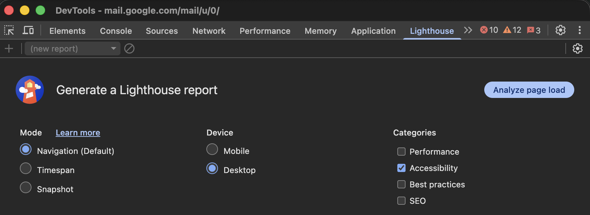{align="center"
fig-alt="une copie d'écran de l'outil d'accessibilité Chrome Lighthouse"
width="60%"}

## Les Couleurs

- **Pièges fréquents** : Mauvais contrastes, information uniquement
  basée sur la couleur.
- **Bonnes pratiques** : Valider les ratios de contraste:
  - minimum 4,5:1 pour le texte normal.
  - minimum 3:1 pour les éléments graphiques significatifs.

Outils de simulation en action

- [viz4.net/palettes](https://www.vis4.net/palettes/#/9%7Cd%7C00429d,96ffea,ffffe0%7Cffffe0,ff005e,93003a%7C0%7C1)
- [ColorBrewer
  2.0](https://colorbrewer2.org/#type=sequential&scheme=YlGn&n=5) —
  Sélection de palettes de couleur par usage, pour l'accessibilité.
- ...

::: notes
à partir de viz-palette, on fait un aller-retour vers colorbrewer2 (ou
pas, puisqu'on peut déja y choisir les palettes compatibles)
:::

## Graphiques : Le problème {.smaller}

`ggplot2` a des paramètres par défaut corrects, mais ils restent
insuffisants pour l'accessibilité (lignes trop fines, contrastes
faibles).

::::: columns
::: {.column width="50%"}
``` r
theme_set(theme_grey(base_size = 11))
g0 <- ggplot(
  data = plot_data,
  mapping = aes(x = x, y = y, colour = category)
) +
  geom_line()
g0
```
:::

::: {.column width="50%"}
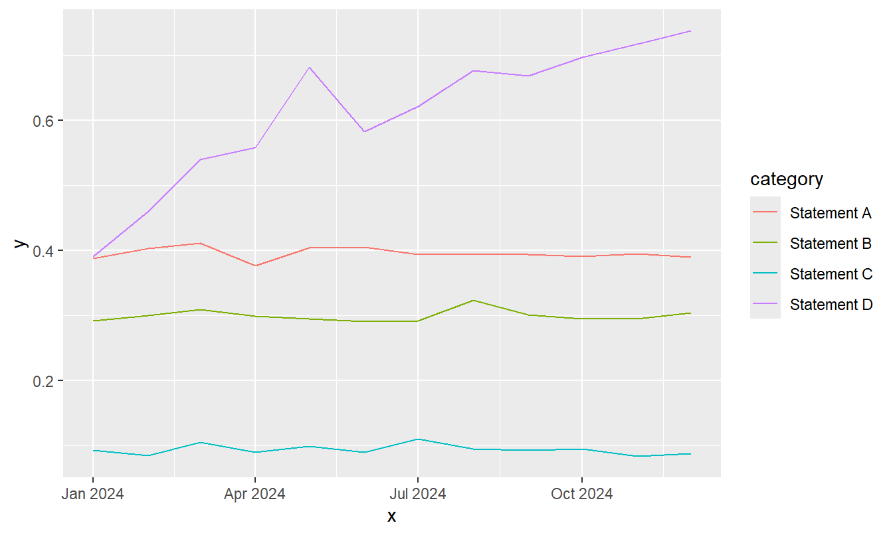{fig-alt="Un graphique en ligne produit par ggplot2 avec les options par default"}
:::
:::::

------------------------------------------------------------------------

### bonnes pratiques : la taille {.smaller}

::::: columns
::: {.column width="50%"}
``` r
theme_set(theme_grey(base_size = 16))
g <- ggplot(
  data = plot_data,
  mapping = aes(x = x, y = y, colour = category)
) +
  geom_line(linewidth = 2)
g
```
:::

::: {.column width="50%"}
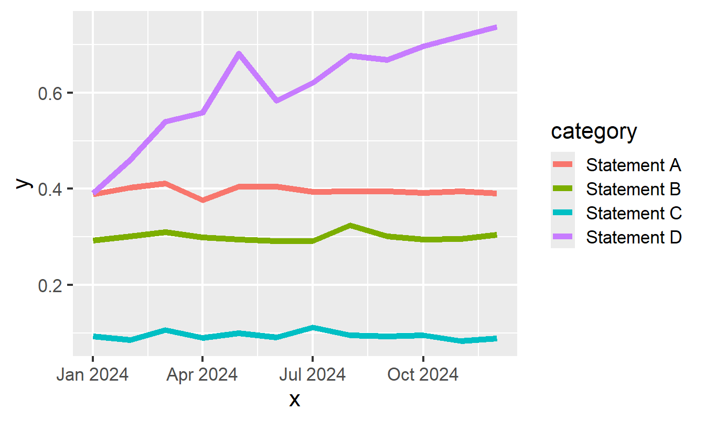{fig-alt="Un graphique en ligne produit par ggplot2 avec des lignes épaisses"}
:::
:::::

------------------------------------------------------------------------

### bonnes pratiques : les couleurs {.smaller}

::::: columns
::: {.column width="50%"}
``` r
theme_set(theme_minimal(base_size = 16))
g <- g + scale_colour_manual(values = okabeito)
g
```
:::

::: {.column width="50%"}
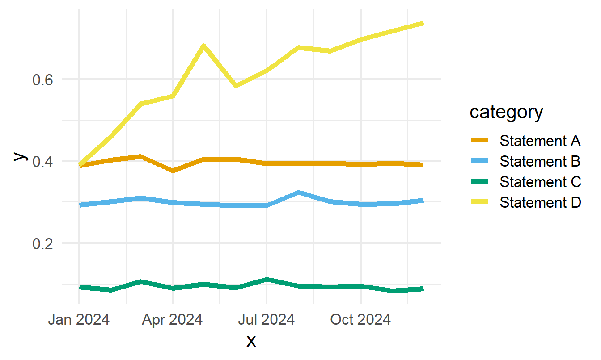{fig-alt="Un graphique en ligne avec des lignes épaisses et une palette accessible"}
:::
:::::

------------------------------------------------------------------------

### bonnes pratiques : ne pas s'appuyer sur les couleurs {.smaller}

::::: columns
::: {.column width="50%"}
``` r
g <- g +
  geom_point(
    data = slice_max(plot_data, x),
    size = 4
  ) +
  new_scale_colour() +
  scale_colour_manual(values = new_palette) +
  geom_text(
    data = slice_max(plot_data, x),
    mapping = aes(label = category, colour = category),
    hjust = -0.1,
    size.unit = "pt",
    size = 14
  ) +
  scale_x_date(
    date_labels = "%b",
    breaks = seq(
      as.Date("01-01-2024", tryFormats = "%d-%m-%Y"),
      length.out = 4,
      by = "3 months"
    ),
    limits = c(
      as.Date("01-01-2024", tryFormats = "%d-%m-%Y"),
      as.Date("01-02-2025", tryFormats = "%d-%m-%Y")
    )
  ) +
  theme(legend.position = "none")
g
```
:::

::: {.column width="50%"}
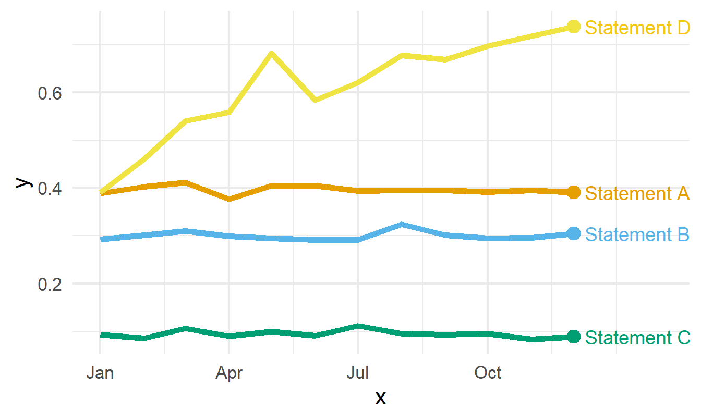{fig-alt="Un graphique en ligne amélioré par des légendes reportées sur les lignes"}
:::
:::::

------------------------------------------------------------------------

### bonnes pratiques : les petits multiples {.smaller}

::::: columns
::: {.column width="50%"}
``` r
theme_set(theme_bw(base_size = 16))
g2 + facet_wrap(~category) +
  gghighlight(use_direct_label = FALSE) +
  scale_x_date(
    date_labels = "%b",
    breaks = seq(
      as.Date("01-01-2024", tryFormats = "%d-%m-%Y"),
      length.out = 4,
      by = "3 months"
    ),
    limits = c(
      as.Date("01-01-2024", tryFormats = "%d-%m-%Y"),
      as.Date("15-12-2024", tryFormats = "%d-%m-%Y")
    )
  ) +
  theme(axis.title = element_blank())
```
:::

::: {.column width="50%"}
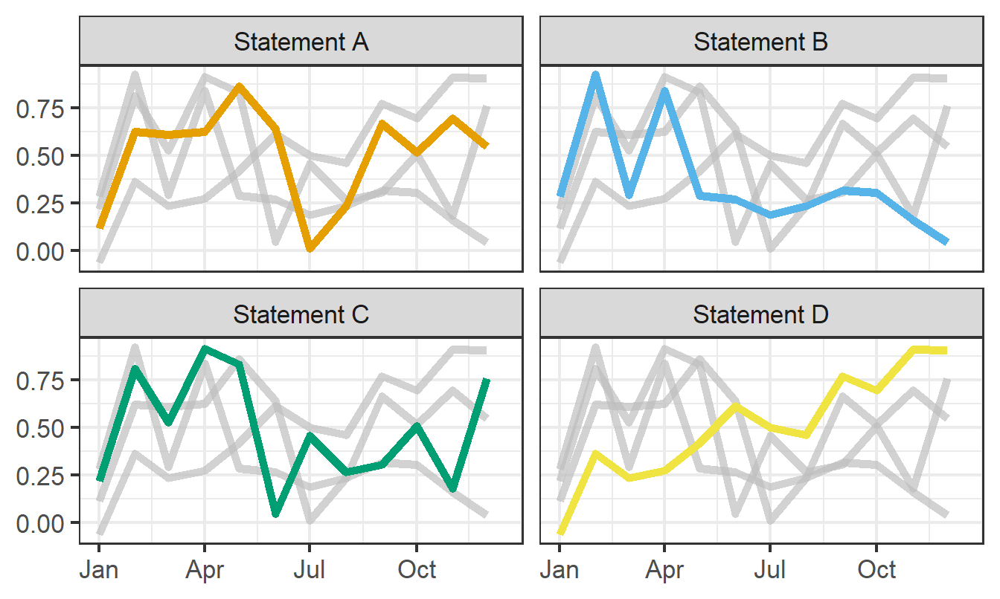{fig-alt="Un petit multiple de graphiques en lignes pour éviter l'effet spagetti"}
:::
:::::

::: callout-note
Étude de cas complète

Retrouvez le blog de Nicola Rennie sur la création de graphiques
linéaires accessibles :

🔗 Nicola Rennie - Accessible Line Chart
:::

## Alt-text pour les graphiques

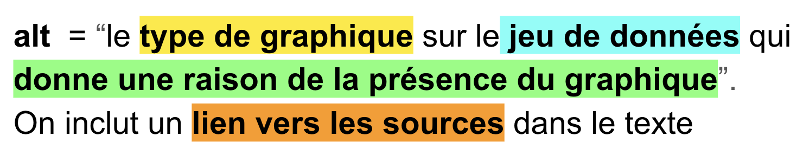{fig-alt="Le format des alt-text pour les dataviz en 4 informations clefs. Type de graphique, Jeu de données, raison du graphique, lien vers les sources."}

------------------------------------------------------------------------

La solution {ggalttext}:

``` r
install.packages("ggalttext", repos = c("https://y-sunflower.r-universe.dev"))
library(ggalttext)
g2 <- g2 + 
  xlab("Mois de l'année") + 
  ylab("Résultat (%)" )
generate_alt_text(plot, lang="fr")
[1] "Graphique en lignes de Résultat (%) en fonction du Mois de l'année."
```

**Type de graphique** : Il est nécessaire de nommer la famille de
graphique, pour donner le contexte à la suite du texte alternatif. ex:
*un diagramme à barres*

Pour le nom des diagrammes, consultez le guide de datavisualization de
[toulouse-dataviz.fr](https://toulouse-dataviz.notion.site/4cea244c76d0407b9722d300e798a3c2?v=f3b7a520de214623a766a5b68456097b)

**Jeu de données** : Quelles données sont présentes dans le graphique ?
les variables des axes x et y le plus généralement

**Raison de la présence du graphique**: Pourquoi avoir inclus ce
graphique, que fait il apparaître : une mention de chaque information
visuelle, qui indique quoi regarder.

**Lien vers les sources** : à inclure dans le texte, pas dans
l'alt-text, pour en faire profiter à tout le monde.

------------------------------------------------------------------------

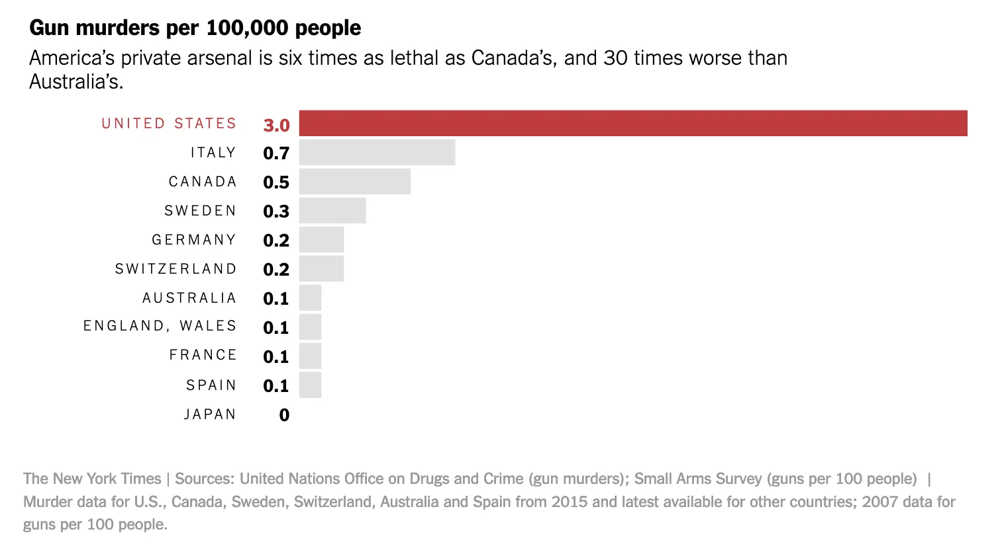{fig-alt="Un graphique en barre extrait du New-York Times sur les décès par arme à feux pour 10000 habitants, dans 10 pays"}

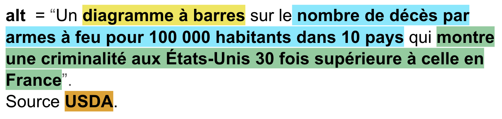{fig-alt="Le text alternatif du graphique précédent avec les 4 parties importantes surlignées par une couleur."}

|  |
|:-----------------------------------------------------------------------|
| Plus difficile |
| 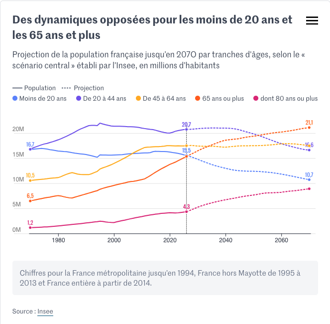{fig-alt="Un graphique en lignes extrait du journal Le Monde sur l'évolution de 5 tranches d'âges de la population française entre 1970 et 2070 qui montre une dynamique croissante des plus de 65 ans et décroissante pour les deux tranches en dessous de 45 ans"} |
| 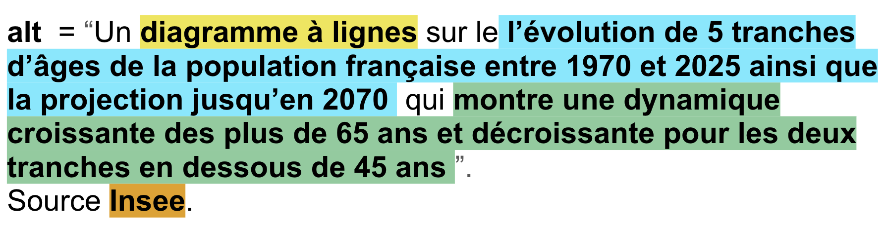{fig-alt="Le text alternatif du graphique précédent avec les 4 parties importantes surlignées par une couleur."} |

## Tableaux

::::: columns
::: {.column width="60%"}
Bonnes et Mauvaise Pratiques

```         
Erreurs classique : 
- Tableaux sous forme d'images non lues.
- Utiliser des caractères de séparation des colonnes.
- Trop de chiffres significatifs pour les nombres.
- fusion de cellules complexe.

Règle d'or : 
- Déclarer explicitement les en-têtes de colonnes et de lignes (<th>).  
- 2 ou 3 chiffres significatifs maximum.
- Mettre en gras les cellules d'intéret.
- Éviter la complexité accrue
```
:::

::: {.column width="40%"}
Expérimentation (spreadsheet)

[Accessibility Empathy for
spreadsheets](https://analysisfunction.civilservice.gov.uk/blog-2/accessibility-empathy-for-spreadsheets/):
Penser à l'utilisateur qui navigue cellule par cellule au clavier.
:::
:::::

## Applications Shiny

### Le challenge

Les composants web générés par défaut par Shiny produisent déjà un HTML
correct et étiqueté. L’accessibilité consiste surtout à ne pas casser
cela, et à ajouter délibérément quelques éléments — ARIA là où c’est
vraiment nécessaire, l’utilisabilité au clavier pour tout ce qui est
personnalisé, un contraste suffisant et du texte alternatif.\
🔗 [Applications Shiny acccessibles : étiquettes, ARIA, clavier et
contraste par
Datanovia](https://www.datanovia.com/fr/learn/programming/shiny/performance/accessibility-performance)
🔗 [Analyse des standards WCAG applicables à
Shiny](https://www.jumpingrivers.com/blog/accessible-shiny-standards-wcag/)

------------------------------------------------------------------------

### La Solution : La leçon d'accessibilité de Datanovia

::: {.callout-tip icon="false"}
## Points Clef

**Chaque entrée a besoin d’une vraie étiquette visible**. L’argument
`label` de Shiny rend déjà un `<label>` en bonne et due forme, lié à
l’entrée — passez donc une vraie étiquette, jamais un simple
placeholder. Ici, l’essentiel de l’accessibilité ne consiste pas à
lutter contre le framework. **Ne recourez à ARIA que là où le HTML est
insuffisant**. Le cas majeur est une région `aria-live` pour qu’un
lecteur d’écran annonce un résultat qui a changé sans déplacer le focus
; `tagAppendAttributes()` ajoute `role` et `aria-*` à n’importe quelle
balise. **Tout doit fonctionner au clavier**. Un ordre de focus logique,
un anneau de focus visible, aucun contrôle réservé à la souris — les
contrôles Shiny natifs sont utilisables au clavier par défaut, donc les
échecs viennent des widgets personnalisés que vous ajoutez. **Respectez
le contraste minimum et ne signalez jamais par la couleur seule**.
`bslib::bs_theme()` définit des couleurs accessibles en un seul endroit
; ajoutez du texte, une icône ou une forme pour qu’un indice rouge/vert
ne soit pas le *seul* indice. **Rendez les graphiques et les tableaux
perceptibles.** Donnez un `alt` à `renderPlot()`, proposez un tableau de
données de repli pour les chiffres, et balisez les tableaux avec un
`<caption>` et `scope`. Une application rapide et fluide est en soi plus
accessible — la leçon sur les performances est l’autre moitié de cette
paire.
:::

------------------------------------------------------------------------

### L'autre solution : `{a11yShiny}` {.smaller}

Ce paquet propose des wrappers (enveloppes) accessibles qui forcent le
respect des exigences structurelles de la **BITV 2.0** et du **WCAG 2.1
AA** (validation des étiquettes, gestion du focus, contrastes élevés).

### Correspondance des fonctions `{a11yShiny}` {.smaller}

| Élément UI | Fonction Native `shiny` / `DT` | Équivalent Accessible `{a11yShiny}` |
|:-----------------------|:-----------------------|:-----------------------|
| **Structure globale** | `fluidPage()` | `a11y_fluidPage(lang = "fr", title = "...")` |
| **Mise en page** | `fluidRow()` / `column()` | `a11y_fluidRow()` / `a11y_column()` |
| **Bouton** | `actionButton()` | `a11y_actionButton()` |
| **Listes & Saisie** | `selectInput()` / `numericInput()` | `a11y_selectInput()` / `a11y_numericInput()` |
| **Tableaux** | `DT::renderDataTable()` | `a11y_renderDataTable()` |
| **Graphiques** | `renderPlot()` (`ggplot2`) | `a11y_ggplot2_line()` / `a11y_ggplot2_bar()` |

------------------------------------------------------------------------

### Exemple d'implémentation UI

Remplacer vos appels de structure et d'inputs classiques :

``` r
library(shiny)
library(a11yShiny)

# Remplacement des fonctions standards par les variantes "a11y_"
ui <- a11y_fluidPage(
  lang = "fr",
  title = "Mon Application Shiny Accessible",
  
  a11y_fluidRow(
    a11y_column(
      width = 6,
      a11y_actionButton("refresh", label = "Rafraîchir les données")
    ),
    a11y_column(
      width = 6,
      a11y_selectInput("choix", label = "Choisir une option", choices = 1:3)
    )
  )
)
```

------------------------------------------------------------------------

### L'outillage de test:

- `{shinya11y}`
- [Accessible Name and Description Inspector
  (ANDI)](https://www.ssa.gov/accessibility/andi/help/install.html)
  add-on de navigateur
- un screen reader
- le site [Web Accessibility Evaluation Tool
  (WAVE)](https://wave.webaim.org/)

------------------------------------------------------------------------

## Les packages

pour les developpeurs de packages

### Les messages utilisateurs

- Utiliser {cli} pour formater des messages textuels clairs, en
  fournissant du contexte.

- Pas d'information relayée par les couleurs (Vert = Succès, Rouge =
  Erreur) sans ajouter de texte ou symbole explicite (✔, ✖).

### Le code

- pas de lignes de "-" ni de "=" comme commentaires

------------------------------------------------------------------------

### Les erreur {.smaller}

- capturer les erreur pour éviter

``` python
In [9]: from delineo import segment_drawing_rfdetr

In [11]: 
    ...:     segment_drawing_rfdetr(
    ...:         input_dir=here("../maelstrom/data/drawings/ata_21/"),
    ...:         checkpoint_path=[27],
    ...:         file_glob="* - 1 _ *",
    ...:         output_parquet=here("data/log/x.parquet")
    ...:     )
---------------------------------------------------------------------------
FileNotFoundError                         Traceback (most recent call last)
Cell In[11], line 1
----> 1 segment_drawing_rfdetr(
      2     input_dir=here("../maelstrom/data/drawings/ata_21/"),
      3     checkpoint_path=[27],
      4     file_glob="* - 1 _ *",
      5     output_parquet=here("data/log/x.parquet")
      6 )

File ~/_AA/delineo/delineo/ml/drawing_segmentation_model.py:191, in segment_drawing_rfdetr(input_dir, checkpoint_path, output_parquet, min_confidence, nms_iou, file_glob)
    167 def segment_drawing_rfdetr(
    168     input_dir: str | Path,
    169     checkpoint_path: str | Path,
   (...)    173     file_glob: str | None = None,
    174 ) -> str:
    175     """Detect drawing views in a directory of engineering drawings and save results to parquet.
    176 
    177     Runs two-scale inference on each image: a global pass at 704px and a tiled pass at
   (...)    189             overrides the default extension filter. Ignored when input_dir is a file.
    190     """
--> 191     engine = TwoScaleInferenceEngine.from_checkpoint(
    192         checkpoint_path=str(checkpoint_path),
    193         threshold=min_confidence,
    194         nms_iou=nms_iou,
    195     )
    196     return _run_segmentation_pipeline(engine, Path(input_dir), Path(output_parquet), file_glob)

File ~/_AA/delineo/delineo/ml/inference.py:111, in TwoScaleInferenceEngine.from_checkpoint(cls, checkpoint_path, model_size, threshold, nms_iou, class_names, patch_size)
    109 if class_names is None:
    110     import torch as _torch
--> 111     _ckpt = _torch.load(local_checkpoint, map_location="cpu", weights_only=False)
    112     _args = _ckpt.get("args") or _ckpt.get("hyper_parameters") or {}
    113     _ckpt_names = getattr(_args, "class_names", None) or (
    114         _args.get("class_names") if isinstance(_args, dict) else None
    115     )

File ~/_AA/delineo/.venv/lib/python3.13/site-packages/torch/serialization.py:1500, in load(f, map_location, pickle_module, weights_only, mmap, **pickle_load_args)
   1497 if "encoding" not in pickle_load_args:
   1498     pickle_load_args["encoding"] = "utf-8"
-> 1500 with _open_file_like(f, "rb") as opened_file:
   1501     if _is_zipfile(opened_file):
   1502         # The zipfile reader is going to advance the current file position.
   1503         # If we want to actually tail call to torch.jit.load, we need to
   1504         # reset back to the original position.
   1505         orig_position = opened_file.tell()

File ~/_AA/delineo/.venv/lib/python3.13/site-packages/torch/serialization.py:768, in _open_file_like(name_or_buffer, mode)
    766 def _open_file_like(name_or_buffer: FileLike, mode: str) -> _opener[IO[bytes]]:
    767     if _is_path(name_or_buffer):
--> 768         return _open_file(name_or_buffer, mode)
    769     else:
    770         if "w" in mode:

File ~/_AA/delineo/.venv/lib/python3.13/site-packages/torch/serialization.py:749, in _open_file.__init__(self, name, mode)
    748 def __init__(self, name: str | os.PathLike[str], mode: str) -> None:
--> 749     super().__init__(open(name, mode))

FileNotFoundError: [Errno 2] No such file or directory: '[27]'
```

------------------------------------------------------------------------

### Les sorties {.smaller}

- se méfier des barres de progression

``` python
Processing Images (RF-DETR): 100%|██████████| 38/38 [01:25<00:00,  2.26s/it]
Creating parquet from Arrow format: 100%|██████████| 1/1 [00:00<00:00, 13.66ba/s]
```

- pas de tableaux reconstitués avec des caractères ASCII

``` python
In [1]: import polars as pl
In [2]: pl.read_parquet(here("data/segmented_rfdetr.parquet")).head(2)
Out[6]: 
shape: (2, 6)
┌─────────┬──────────────────────┬────────────┬────────────┬───────┬───────┐
│ class   ┆ bbox                 ┆ confidence ┆ drawing    ┆ sheet ┆ issue │
│ ---     ┆ ---                  ┆ ---        ┆ ---        ┆ ---   ┆ ---   │
│ str     ┆ list[i64]            ┆ f64        ┆ str        ┆ str   ┆ str   │
╞═════════╪══════════════════════╪════════════╪════════════╪═══════╪═══════╡
│ table   ┆ [7664, 5852, … 6522] ┆ 0.929105   ┆ E214-72604 ┆ 017   ┆ B     │
│ section ┆ [166, 362, … 3941]   ┆ 0.918917   ┆ E214-72604 ┆ 017   ┆ B     │
└─────────┴──────────────────────┴────────────┴────────────┴───────┴───────┘
```

alternative

``` r
library(dplyr)
library(arrow)
read_parquet(here("data/segmented_rfdetr.parquet")) |>
  head(2)

# A tibble: 2 × 6
  class   bbox      confidence drawing    sheet issue
  <chr>   <list>         <dbl> <chr>      <chr> <chr>
1 table   <int [4]>      0.929 E214-72604 017   B    
2 section <int [4]>      0.919 E214-72604 017   B     
```

## La documentation (le site web)

exemple d'erreur sur la publication du site web de documentation avec
{pkgdown}

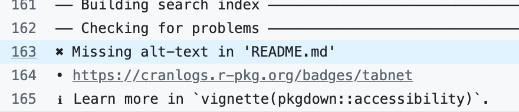{fig-alt="Une copie d'écran du message de publication de pkgdown avec un alt-text manquant dans le fichier README.md"}

Assurer la cohérence des figures, des styles, des couleurs.

Minimiser la surprise du lecteur

## La production de documents techniques et scientifiques avec quarto


## La production de documents

### HTML (quarto 1.8)

- Vérification de l'accessibilité avec `axe-core` (html, dashboard,
  revealjs)

:::::: columns
::: {.column width="35%"}
``` yaml
format:
  html:
    axe: 
      standard: wcag21aa
      best-practice: true
```
:::

::: {.column width="30%"}
``` yaml
format:
  html:
    axe:
      output: document
```
:::

::: {.column width="25%"}
``` yaml
format:
  html:
    axe:
      output: json
```
:::
::::::

###  HTML (quarto 1.10)

- Navigabilité des boutons de la barre de navigation , de la barre verticale, et des modes
  dark/light

### PDF (quarto 1.9)

- Vérification des standard UA-1 et UA-2 (Typst & LaTeX)

------------------------------------------------------------------------

::::: columns
::: {.column width="50%"}
PDF (LaTeX): Standard UA-2

``` yaml
format:
  pdf:
    pdf-standard: ua-2
```

```{mermaid}
flowchart TD
    A["📄 Quarto markdown"]
    B["⚙️ Compilation LaTeX<br/>(Génération du PDF balisé <br/> Pas de contrôle d'accessibilité)"]
    C["🔍 Validation Externe <br/>(Quarto lance veraPDF)"]
    D["⚠️ PDF Final produit avec des Warnings<br/>(Compilation non bloquée <br/> malgré les erreurs)"]

    A --> B
    B --> C
    C --> D

    %% Personnalisation des styles
    style A fill:#f1f5f9,stroke:#64748b,stroke-width:2px,color:#1e293b
    style B fill:#e0f2fe,stroke:#0ea5e9,stroke-width:2px,color:#0369a1
    style C fill:#f0fdf4,stroke:#10b981,stroke-width:2px,color:#14532d
    style D fill:#fef2f2,stroke:#f43f5e,stroke-width:2px,color:#991b1b
```
:::

::: {.column width="50%"}
Typst: Standard UA-1

``` yaml
format:
  typst:
    pdf-standard: ua-1
```

```{mermaid}
flowchart TD
    A["📄 Quarto markdown"]
    B{"🛡️ Validatio native Typst<br/>(Contrôle en temps réel)"}
    C["❌ Blocage lors de la Compilation<br/>(Aucun PDF généré si titre ou <br/>(alt-text manquant)"]
    D["🔍 Validation Externe (veraPDF)<br/>(Contrôle de conformité finale)"]
    E["✅ PDF Conforme produit"]

    A --> B
    B -->|Infraction détectée| C
    B -->|Structure valide| D
    D --> E

    %% Personnalisation des styles
    style A fill:#f1f5f9,stroke:#64748b,stroke-width:2px,color:#1e293b
    style B fill:#fff7ed,stroke:#ea580c,stroke-width:2px,color:#7c2d12
    style C fill:#fee2e2,stroke:#ef4444,stroke-width:2px,color:#991b1b
    style D fill:#f0fdf4,stroke:#10b981,stroke-width:2px,color:#14532d
    style E fill:#ecfdf5,stroke:#059669,stroke-width:2px,color:#064e3b
```
:::
:::::

------------------------------------------------------------------------

## Exemple

``` markdown
---
title: Test de la validation d'accessibilité quarto

format:
  html: 
    axe:
      output: document
---

Voici une violation des rêgles de contraste: [Texte en contraste insuffisant.]{style="color: #eee"}.
```

package {verapdf} (TBC)

# Questions & partages

https://cregouby.github.io/RR_2026/

::: notes
sources
https://github.com/orgs/quarto-dev/discussions?discussions_q=is%3Aopen+label%3Aaccessibility+
Dataviz Accessibility pages / people :
https://github.com/dataviza11y/resources Whriting Alt-Text :
https://medium.com/nightingale/writing-alt-text-for-data-visualization-2a218ef43f81
Colors : https://colorbrewer2.org/#type=sequential&scheme=YlGn&n=5
https://projects.susielu.com/viz-palette?colors=%5B%22%23e69f00%22%2C%22%2356b4e9%22%2C%22%23009e73%22%2C%22%23f0e442%22%5D&backgroundColor=%22white%22&fontColor=%22black%22&mode=%22deuteranopia%22
:::

```{=html}
<script>
/* Simulation dyslexie — premier slide (titre + auteur) */
(function () {
  'use strict';

  var CFG = {
    scrambleProb: 0.55,  // probabilité qu'un mot soit mélangé
    flipProb:     0.20,  // probabilité qu'une lettre soit retournée
    omitProb:     0.15,  // probabilité qu'une lettre soit supprimée
    addProb:      0.15,  // probabilité qu'une lettre soit insérée
    ghostOpacity: 0.28,  // opacité du fantôme (double-vision)
    burstMs:       97,   // durée visible de chaque perturbation (ms)
    baseInterval: 470,   // intervalle minimum entre perturbations (ms)
    randInterval: 320,   // variation aléatoire de l'intervalle (ms)
    startDelay:   1200   // délai initial avant la première perturbation (ms)
  };

  /* Paires de caractères visuellement confondus en lecture dyslexique */
  var REVERSALS = {
    'b':'d','d':'b','p':'q','q':'p',
    'n':'u','u':'n','B':'D','D':'B',
    '1':'l','l':'1','L':'1',
    '0':'O','O':'0','o':'0'
  };

  /* Lettres fréquentes pour les insertions aléatoires */
  var COMMON = 'aeioutsrnle';

  /* Sélecteurs couvrant le titre et les variantes Quarto de l'auteur */
  var SELECTORS = [
    'h1', 'h2.subtitle',
    '.quarto-title-author-name', '.author', 'p.author', '.quarto-title-meta-contents p'
  ];

  var st = {
    active: false,
    targets: [],        // [{el, nodes:[{node, orig}]}]
    nextTimeout: null,
    restoreTimeout: null
  };

  /* ── utilitaires ───────────────────────────────────────────────── */

  function getTextNodes(el) {
    var acc = [], w = document.createTreeWalker(el, NodeFilter.SHOW_TEXT, null, false), n;
    while ((n = w.nextNode())) { if (n.textContent.trim()) acc.push(n); }
    return acc;
  }

  /* ── transformations du mot ────────────────────────────────────── */

  function scrambleWord(word) {
    var c = word.split('');
    if (c.length < 3) return word;

    var roll = Math.random();

    if (roll < 0.45) {
      /* Mélange : échange de deux lettres adjacentes intérieures */
      var i = 1 + Math.floor(Math.random() * (c.length - 2));
      var tmp = c[i]; c[i] = c[i + 1]; c[i + 1] = tmp;

    } else if (roll < 0.45 + CFG.omitProb) {
      /* Oubli : suppression d'une lettre intérieure */
      var pos = 1 + Math.floor(Math.random() * (c.length - 2));
      c.splice(pos, 1);

    } else if (roll < 0.45 + CFG.omitProb + CFG.addProb) {
      /* Ajout : insertion d'une lettre parasite */
      var ins = 1 + Math.floor(Math.random() * (c.length - 1));
      c.splice(ins, 0, COMMON[Math.floor(Math.random() * COMMON.length)]);
    }

    /* Retournement : substitution par une lettre miroir */
    return c.map(function (ch) {
      return (Math.random() < CFG.flipProb && REVERSALS[ch]) ? REVERSALS[ch] : ch;
    }).join('');
  }

  function scrambleText(text) {
    /* Capture les tokens alphanumériques : lettres seules ET mixtes chiffres+lettres */
    return text.replace(/[a-zA-ZÀ-ÿéèêëàâîïùûôç0-9]+/g, function (w) {
      return (Math.random() < CFG.scrambleProb) ? scrambleWord(w) : w;
    });
  }

  /* ── ghost : décalage aléatoire à chaque burst ─────────────────── */

  function ghostShadow() {
    var dx = (Math.random() * 4 + 2).toFixed(1);
    var dy = (Math.random() * 2 + 1).toFixed(1);
    return dx + 'px ' + dy + 'px 0.2px rgba(80,80,200,' + CFG.ghostOpacity + ')';
  }

  /* ── cycle burst / restore ─────────────────────────────────────── */

  function doBurst() {
    if (!st.active || st.targets.length === 0) return;

    st.targets.forEach(function (t) {
      /* Scramble texte */
      t.nodes.forEach(function (o) { o.node.textContent = scrambleText(o.orig); });

      /* Décalages visuels + double-vision */
      t.el.style.letterSpacing = (Math.random() * 4 - 1).toFixed(2) + 'px';
      t.el.style.transform     = 'translateX(' + (Math.random() * 8  - 4  ).toFixed(1) + 'px)'
                               + ' translateY(' + (Math.random() * 3  - 1.5).toFixed(1) + 'px)';
      t.el.style.opacity       = (0.70 + Math.random() * 0.30).toFixed(2);
      t.el.style.textShadow    = ghostShadow();
    });

    /* Restauration après burstMs */
    st.restoreTimeout = setTimeout(function () {
      st.targets.forEach(function (t) {
        t.nodes.forEach(function (o) { o.node.textContent = o.orig; });
        t.el.style.letterSpacing = '';
        t.el.style.transform     = '';
        t.el.style.opacity       = '';
        t.el.style.textShadow    = '';
      });
    }, CFG.burstMs);
  }

  function scheduleNext() {
    if (!st.active) return;
    var delay = CFG.baseInterval + Math.floor(Math.random() * CFG.randInterval);
    st.nextTimeout = setTimeout(function () { doBurst(); scheduleNext(); }, delay);
  }

  /* ── start / stop ──────────────────────────────────────────────── */

  function startEffect(slideEl) {
    if (!slideEl) return;
    var targets = [];
    SELECTORS.forEach(function (sel) {
      slideEl.querySelectorAll(sel).forEach(function (el) {
        var nodes = getTextNodes(el);
        if (!nodes.length) return;
        /* Éviter les doublons si plusieurs sélecteurs matchent le même élément */
        for (var k = 0; k < targets.length; k++) { if (targets[k].el === el) return; }
        targets.push({
          el: el,
          nodes: nodes.map(function (n) { return { node: n, orig: n.textContent }; })
        });
        el.style.transition = 'letter-spacing 0.06s ease, transform 0.06s ease,'
                            + ' opacity 0.06s ease, text-shadow 0.06s ease';
      });
    });
    if (!targets.length) return;
    st.targets = targets;
    st.active  = true;
    st.nextTimeout = setTimeout(function () { doBurst(); scheduleNext(); }, CFG.startDelay);
  }

  function stopEffect() {
    st.active = false;
    clearTimeout(st.nextTimeout);
    clearTimeout(st.restoreTimeout);
    st.targets.forEach(function (t) {
      t.nodes.forEach(function (o) { o.node.textContent = o.orig; });
      t.el.style.letterSpacing = '';
      t.el.style.transform     = '';
      t.el.style.opacity       = '';
      t.el.style.textShadow    = '';
      t.el.style.transition    = '';
    });
    st.targets = [];
  }

  /* ── hook RevealJS ─────────────────────────────────────────────── */

  window.addEventListener('load', function () {
    if (typeof Reveal === 'undefined') return;
    var inited = false;

    function maybeStart() {
      if (inited) return;
      inited = true;
      var idx = Reveal.getIndices();
      if (idx.h === 0) startEffect(Reveal.getCurrentSlide());
    }

    Reveal.on('ready', maybeStart);
    if (Reveal.isReady()) maybeStart();

    Reveal.on('slidechanged', function (ev) {
      stopEffect(); inited = false;
      if (ev.indexh === 0) startEffect(ev.currentSlide);
    });
  });
}());
</script>
```
