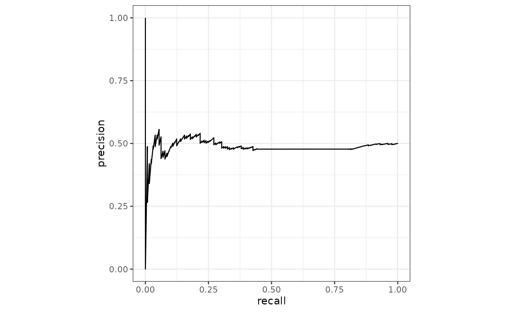
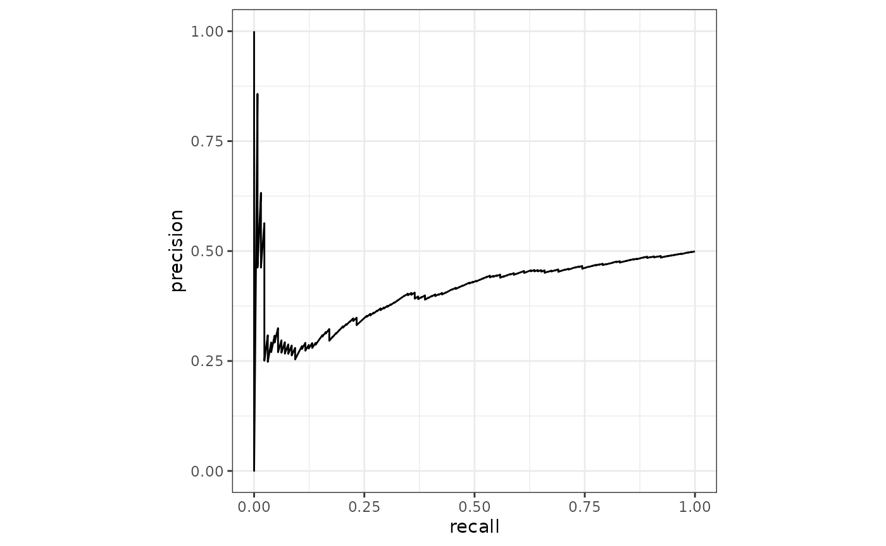

L’univers des packages {torch}, le « mlverse », s’est enrichi durant l’année écoulée grâce à des améliorations considérables des packages historiques, une expansion vers de nouveaux domaines métiers et une adoption croissante par la communauté. Je vous présenterai toute cette richesse lors d'une conférence courte, en démontrant à quel point les échanges lors des précédentes Rencontres R ont favorisé cette expansion. Une véritable invitation à se rencontrer, collaborer et contribuer.

**Mots-clefs (3 à 5)** : Apprentissage profond - Torch - IA - Package - Écosystème R

## Le mlverse

Un univers de packages dédiés au deep learning

autour de {torch} un package d'API R de `libtorch` la librairie C++ derrière pytorch.

On exclue aujourd'hui les packages qui reposent sur reticulate ?

------------------------------------------------------------------------

## Le mlverse en 2026

la jungle / les groupes (coeur / applications / fondation / services)

------------------------------------------------------------------------

## Les nouveauté 2026 : {torch}

- passage à libtorch 2.8 (équivalent de pytorch 2.8)
- amélioration des performances
- ajout de `torch_scaled_dot_product_attention()` pour la performance des transformers.
- ajout de `nn_aum_loss()` pour la classification binaire déséquilibrée
- ajout de `install_torch_sitrep()` pour un diagnostique profond de l'installation.

------------------------------------------------------------------------

## Les nouveauté 2026 : {torchvision}

- ajout de 43 datasets regroupés dans des collections.
- ajouts de 26 datasets unitaires, regroupés par tâche de vision
- ajout de modèles de détection d'objet `fasterrcnn` et `maskrcnn`

| Tâche | Classification | Détection d'objet | Segmentation sémantique | Sous-titrage |
|---------------|---------------|---------------|---------------|---------------|
| nombre de jeux de données | 28 | 45 | 4 | 3 |
| nombre de modèles | 52 | 14 | 10 |  |

: les jeux de données par tâche de vision

------------------------------------------------------------------------

## Les nouveauté 2026 : {tabnet}

- ajout de `nn_aum_loss()` pour la classification binaire déséquilibrée. Exemple sur modeldata::lending_club() (ratio de 18 pour 1)

  ::::: columns
  ::: {.column width="50%"}
  
  :::

  ::: {.column width="50%"}
  
  :::
  :::::

